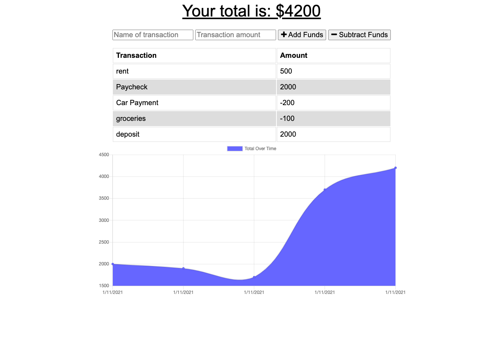

# budgetTracker

Is an online/offline budget tracker to enable users to enter their deposits and withdrawls even if not online.  Utilizing IndexedDB for offline mode and a MongoDB for online mode, this allows a user to always know their balance at any time.

Installation
 npm install

 Application deployed to [Heroku]

Screenshot:

Questions?
GitHub Link: chefjaypeek